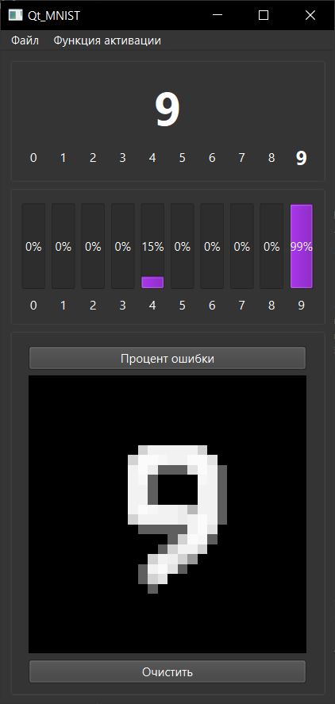

# Нейронная сеть MNIST на Qt

[English](README.md) | Русский

Реализация нейронной сети на Qt для распознавания рукописных цифр (подобно MNIST). Честно говоря, я не до конца понимаю, как это работает, но каким-то образом оно умудряется распознавать цифры!

## Интерфейс

## Возможности

- Рисование цифр мышкой
- Распознавание цифр в реальном времени
- Две функции активации:
  - Сигмоида
  - ReLU
- Предобученные веса сети
- Возможность обучения
- Расчёт ошибки
- Сохранение/загрузка весов сети

## Технические детали

Проект реализует простую нейронную сеть с:
- Входным слоем (784 нейрона - 28x28 пикселей)
- Скрытым слоем (настраиваемым)
- Выходным слоем (10 нейронов - цифры 0-9)

### Предобученные модели
- `sigmoid train.nnw`, `sigmoid test.nnw`, `sigmoid smol.nnw` - Сети, обученные с функцией активации Sigmoid
- `ReLU train.nnw`, `ReLU test.nnw`, `ReLU smol.nnw` - Сети, обученные с функцией активации ReLU

## Сборка и запуск

### Требования
- Qt 5.x или выше
- Компилятор C++ с поддержкой C++11
- QtCreator (рекомендуется)

### Шаги сборки
1. Откройте `Qt_MNIST.pro` в QtCreator
2. Настройте проект
3. Соберите и запустите

## Использование

1. Запустите приложение
2. Нарисуйте цифру в области рисования
3. Сеть попытается её распознать
4. Используйте прогресс-бары для просмотра уровня уверенности сети в каждой цифре
5. Очистите область рисования, чтобы попробовать другую цифру

## Известные особенности (или баги? Кто знает!)
- Иногда сеть очень уверена в неправильных ответах
- Стиль рисования сильно влияет на распознавание
- Процесс обучения... скажем так, "загадочный"

## Лицензия
Этот проект предоставляется как есть в образовательных целях. Используйте на свой страх и риск - у нейронной сети может быть собственное мнение о вашем почерке!
