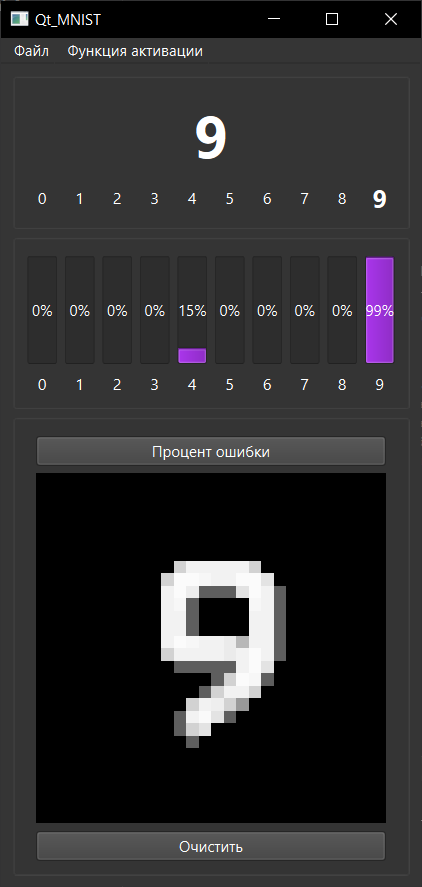

# Qt MNIST Neural Network

English | [Русский](README-RU.md)

A Qt-based implementation of a neural network for handwritten digit recognition (MNIST-like). To be honest, I'm not entirely sure how it works, but somehow it manages to recognize digits!

## Interface

## Features

- Draw digits using mouse
- Real-time digit recognition
- Two activation functions:
  - Sigmoid
  - ReLU
- Pre-trained network weights included
- Training capability
- Error calculation
- Save/Load network weights

## Technical Details

The project implements a simple neural network with:
- Input layer (784 neurons - 28x28 pixels)
- Hidden layer (configurable)
- Output layer (10 neurons - digits 0-9)

### Pre-trained Models
- `sigmoid train.nnw`, `sigmoid test.nnw`, `sigmoid smol.nnw` - Networks trained with Sigmoid activation
- `ReLU train.nnw`, `ReLU test.nnw`, `ReLU smol.nnw` - Networks trained with ReLU activation

## Building and Running

### Requirements
- Qt 5.x or higher
- C++ compiler with C++11 support
- QtCreator (recommended)

### Build Steps
1. Open `Qt_MNIST.pro` in QtCreator
2. Configure project
3. Build and run

## Usage

1. Launch the application
2. Draw a digit in the drawing area
3. The network will attempt to recognize it
4. Use the progress bars to see confidence levels for each digit
5. Clear the drawing area to try another digit

## Known Features (or Bugs? Who knows!)
- Sometimes the network is very confident about wrong answers
- Drawing style significantly affects recognition
- The training process is... let's say "mysterious"

## License
This project is provided as-is for educational purposes. Use at your own risk - the neural network might have its own opinions about your handwriting!
